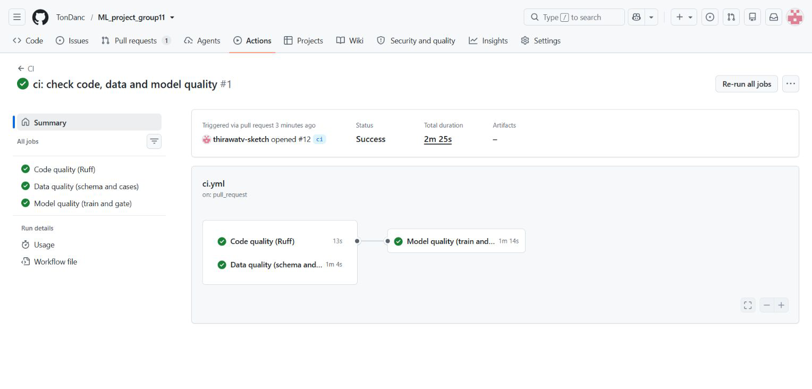
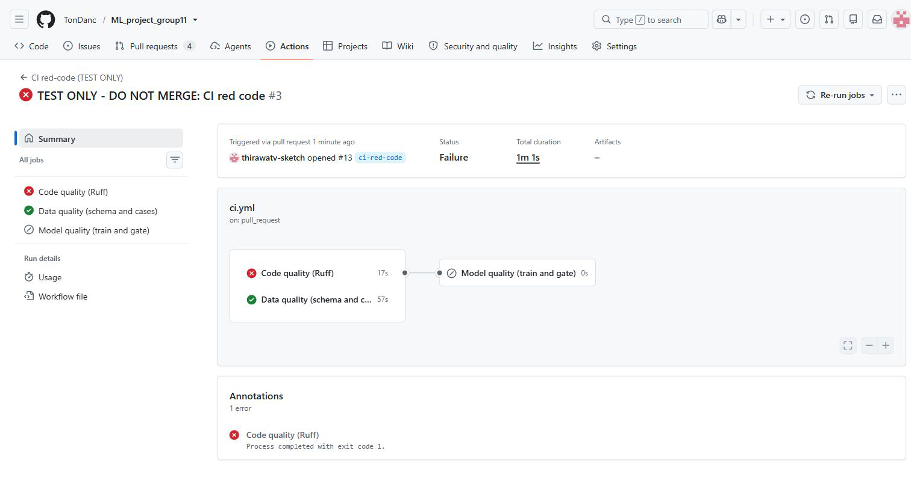
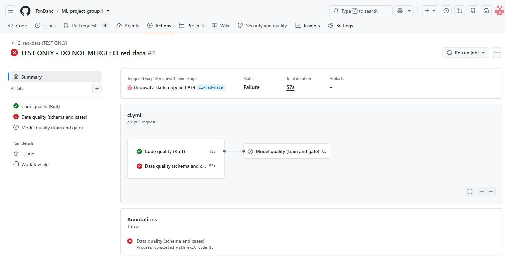
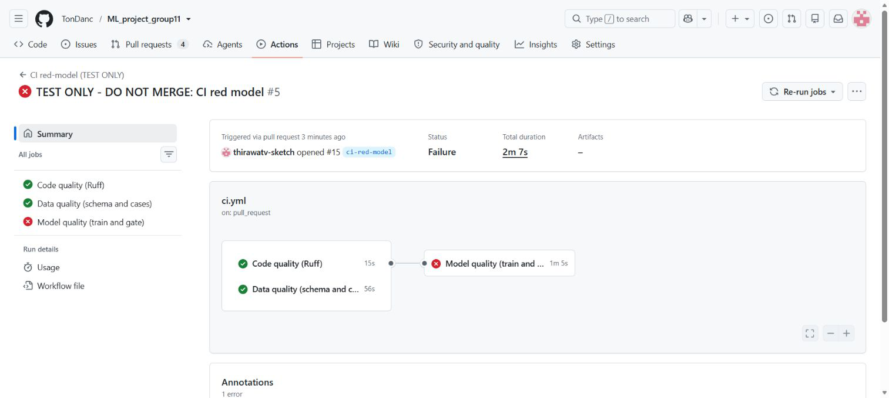

# CI: code, data and model quality

งานของ `thirawatv-sketch` ตาม GUIDE ส่วน 4.3 ใช้ GitHub Actions เพราะผูกกับ PR ของ repository ได้โดยตรง และแสดงผลแต่ละด้านแยกเป็น job เพื่อให้ทราบว่าต้องแก้ส่วนไหน

## ไฟล์และจุดสำคัญ

- `.github/workflows/ci.yml` กำหนดเหตุการณ์เริ่มตรวจ, environment และ 3 job
- `requirements-dev.txt` pin `ruff==0.15.1` ให้ผล lint ใช้กฎเวอร์ชันเดียวกันทุกครั้ง
- ทุก job ใช้ Python 3.11 ตาม Dockerfile และ Ubuntu 24.04
- เริ่มทำงานเมื่อเปิดหรืออัปเดต PR, push เข้า `main` หรือกด `Run workflow` บนหน้า Actions
- `GIT_COMMIT` รับค่า `github.sha` เพื่อบันทึกเวอร์ชันโค้ด ส่วน `MLFLOW_TRACKING_URI` ใช้ `sqlite:///mlflow.db` ที่อยู่ใน runner ของแต่ละ job
- `needs: [code-quality, data-quality]` ทำให้เริ่ม train หลังการตรวจโค้ดและข้อมูลผ่านแล้วเท่านั้น
- ตั้ง timeout ของ job ไว้ 5, 10 และ 20 นาที และยกเลิกรอบเก่าของ PR เดียวกันเมื่อมีรอบใหม่

CI นี้ train และ promote ในฐานข้อมูลชั่วคราวบน runner เพื่อพิสูจน์ว่าโมเดลผ่านเกณฑ์ การ deploy หรือเปลี่ยน champion ของระบบที่ใช้งานจริงเป็นขั้นตอนของผู้ดูแลระบบ

## สิ่งที่ตรวจ

| Job | คำสั่งหลัก | ความหมายเมื่อไม่ผ่าน |
|---|---|---|
| Code quality | `python -m ruff check src tests` และ `loadtest` เมื่อมีโฟลเดอร์ | พบโค้ดผิดกฎ เช่น import ที่ไม่ใช้ หรือชื่อที่ไม่ได้ประกาศ |
| Data quality | `python src/test_schema.py` และ `python tests/check_cases.py` | schema ยอมรับข้อมูลเสียหรือปฏิเสธข้อมูลดี |
| Model quality | `python src/train.py` แล้ว `python src/registry.py promote` | train มีปัญหา หรือ gate ปฏิเสธโมเดลด้วย exit code ที่ไม่ใช่ 0 |

Code quality ติดตั้งเฉพาะ dev dependencies ส่วน Data และ Model ติดตั้ง `requirements.txt` กับ `requirements-dev.txt` โดยใช้ pip cache ช่วยลดเวลาดาวน์โหลด

### การรองรับโครงสร้าง repo ปัจจุบัน

ขณะสร้าง CI ยังไม่มี `loadtest/` workflow จึงตรวจ `src` และ `tests` ก่อน และรวม `loadtest` เข้า lint อัตโนมัติเมื่อโฟลเดอร์ของเพื่อนเข้ามา

`tests/check_cases.py` ตั้ง `sys.path` ก่อน import `schema` เพื่อให้รันจากโฟลเดอร์หลักได้ จึงยกเว้น `E402` เฉพาะไฟล์นี้ด้วย `--per-file-ignores 'tests/check_cases.py:E402'` กฎอื่นและไฟล์อื่นยังถูกตรวจตามปกติ หากเปลี่ยนวิธี import ในอนาคต สามารถเอาข้อยกเว้นนี้ออกได้

### Model gate

ค่าเริ่มต้น `CANDIDATES=dummy_median,hgb_default` ตาม GUIDE ผู้ดูแลเลือกค่าเองได้จาก input `candidates` ของ `workflow_dispatch` โดยส่ง input ผ่าน environment ให้โปรแกรมอ่าน

`registry.py` เป็นผู้ตรวจว่า MAE ชนะ dummy, P95 ต่ำกว่า 200 ms และถ้ามี champion เดิมต้องดีขึ้นตามเกณฑ์ของระบบ runner ใหม่ไม่มี champion เดิม จึงตรวจเกณฑ์แรกสองข้อ การ gate ปฏิเสธต้องแสดง job ล้มตาม exit code ของสคริปต์

## วิธีตรวจบนเครื่องตัวเอง (PowerShell)

ใช้ Python 3.11 ใน virtual environment แล้วเปิด PowerShell ใหม่และรันจากโฟลเดอร์หลักของโปรเจกต์ หากเรียก `python` ไม่ได้ ให้ใช้เส้นทาง interpreter ของ virtual environment แทน

```powershell
python -m pip install -r requirements.txt -r requirements-dev.txt
$taskLintTargets = @('src', 'tests')
if (Test-Path -LiteralPath loadtest -PathType Container) { $taskLintTargets += 'loadtest' }
python -m ruff check $taskLintTargets --target-version py311 --per-file-ignores 'tests/check_cases.py:E402'
python src/test_schema.py
python tests/check_cases.py
$env:CANDIDATES = 'dummy_median,hgb_default'
$taskCiDb = Join-Path ([System.IO.Path]::GetTempPath()) ('ml-group11-ci-' + [guid]::NewGuid().ToString('N') + '.db')
$env:MLFLOW_TRACKING_URI = 'sqlite:///' + $taskCiDb.Replace('\', '/')
$env:GIT_COMMIT = git rev-parse HEAD
python src/train.py
python src/registry.py promote
Remove-Item Env:CANDIDATES, Env:MLFLOW_TRACKING_URI, Env:GIT_COMMIT -ErrorAction SilentlyContinue
```

คำสั่งนี้สร้างฐานข้อมูลทดสอบชื่อใหม่ใน Temp เพื่อให้ผลเหมือน runner ใหม่และไม่เปลี่ยน champion ของฐานข้อมูลที่ API ใช้ artifacts ที่สคริปต์สร้างใน `mlruns/` เป็นผลทดสอบในเครื่องและถูก gitignore ไว้แล้ว

## เก็บหลักฐานก่อนส่งงาน

1. รอบเขียว: เปิด PR ปกติ ต้องเห็นทั้ง 3 job ผ่าน เก็บภาพ `docs/img/ci-green.png`
2. รอบแดงด้านโค้ด: branch `ci-red-code` สร้างไฟล์ `import os` ที่ไม่ใช้ใน `RUNNER_TEMP` แล้วเพิ่มไฟล์นี้เข้า Ruff ต้องได้ `F401` และ exit 1 เก็บภาพ `docs/img/ci-red-code.png`
3. รอบแดงด้านข้อมูล: branch `ci-red-data` ปิด range check ของ `customer_lat` เฉพาะในหน่วยความจำของ process บน runner แล้วเรียก `src/test_schema.py` เดิมด้วย `runpy` ต้องได้ `AssertionError` ที่ `assert rejects(customer_lat=40.0)` เก็บภาพ `docs/img/ci-red-data.png` ไม่มีการแก้ไฟล์ `schema.py` หรือ `test_schema.py`
4. รอบแดงด้านโมเดล: branch `ci-red-model` ตั้ง `CANDIDATES=dummy_median` ใน workflow ทดสอบ แล้วใช้คำสั่ง train/gate เดิม ต้องเห็น Model quality ล้มเพราะ MAE ไม่ชนะ dummy เก็บภาพ `docs/img/ci-red-model.png` กรณีนี้รันผ่าน PR แบบร่างเพื่อไม่ต้องนำ workflow เข้า `main` ก่อน; หลัง merge CI ปกติแล้วจึงใช้ Actions → Run workflow พร้อม input `candidates=dummy_median` ได้

ทั้ง 3 branch ใช้ทดสอบเท่านั้น ห้าม merge ไฟล์ที่แก้เทียบกับ branch `ci` มีเพียง `.github/workflows/ci.yml` และไม่มีการแก้โค้ดของสมาชิกคนอื่น

ต้องเก็บผลจาก Actions จริง ชื่อภาพใช้คำนำหน้า `ci-` และส่งให้ TonDanc ใช้ประกอบรายงาน

## สถานะการตรวจสอบ

ตรวจบน Python 3.11.15 ด้วย dependencies ตาม `requirements.txt` และ `requirements-dev.txt` โดยรัน schema และ train/gate บนสำเนา source/data ใน Temp:

| การตรวจ | ผลในเครื่อง |
|---|---|
| YAML และการเชื่อม job | ผ่าน: trigger ทั้ง 3 แบบ, Python 3.11, input candidates, timeouts และ model job รอ code/data |
| Ruff | ผ่าน โดยใช้ข้อยกเว้น import ตามที่อธิบาย |
| Schema | `schema checks ok` |
| Test cases | ผ่านทั้ง 6 ไฟล์ |
| Train และ gate รอบปกติ | ผ่าน: `hgb_default` test MAE 3.389 วัน, dummy MAE 5.057 วัน, P95 14.6 ms และ `PROMOTED` |
| รอบแดงด้านโค้ดในสำเนาชั่วคราว | import ที่ไม่ใช้ถูกจับด้วย `F401`, exit 1 |
| รอบแดงด้านข้อมูลในสำเนาชั่วคราว | ถอดข้อจำกัด latitude แล้ว schema test จับได้ด้วย `AssertionError`, exit 1 |
| รอบแดงด้านโมเดลในสำเนาชั่วคราว | `dummy_median` อย่างเดียวถูก gate ปฏิเสธ เพราะ MAE 5.057 วันเท่ากับ dummy, exit 1 |

ค่าความเร็วในตารางเป็นผลของเครื่องทดสอบนี้ ส่วน runner บน GitHub วัดใหม่และตัดสินผ่าน gate ของตัวเอง ผลรอบเขียวจริงอยู่ด้านล่าง

## ผล GitHub Actions จริง

วันที่ 2 ตุลาคม 2569 เปิด [PR #12](https://github.com/TonDanc/ML_project_group11/pull/12) แบบร่างจาก branch `ci` เข้า `main` และ [CI รอบที่ 1](https://github.com/TonDanc/ML_project_group11/actions/runs/37035012333) ของ commit `878c2a4` ผ่านครบ 3 job ใช้เวลารวม 2 นาที 25 วินาที บน Python 3.11.16 และ Ubuntu 24.04

| Job | ผลจริงบน GitHub | ระยะเวลา |
|---|---|---|
| Code quality (Ruff) | ผ่าน | 13 วินาที |
| Data quality (schema and cases) | ผ่าน: schema และ test cases ทั้ง 6 ไฟล์ | 1 นาที 4 วินาที |
| Model quality (train and gate) | ผ่าน: `PROMOTED v1 to @champion` ในฐานทดสอบของ runner | 1 นาที 14 วินาที |

โมเดล `hgb_default` มี test MAE 3.389 วัน เทียบ dummy MAE 5.057 วัน และ P95 9.2 ms จึงผ่าน gate



ผลข้างต้นเก็บจาก PR #12 ซึ่งเปิดเป็นแบบร่างในเวลาทดสอบ ผลรอบแดงจริงครบทั้ง 3 ด้านอยู่ด้านล่าง ส่วนตารางก่อนหน้าเป็นผลการทดสอบในเครื่อง สถานะการส่งงานล่าสุดอยู่ในหัวข้อสถานะส่งงานรวม

## ผล CI รอบแดงบน GitHub Actions

วันที่ 3 ตุลาคม 2569 ทดสอบผ่าน PR แบบร่างแยก 3 อันบน branch ทดสอบ แต่ละรอบจบเป็น `failure` ด้วย exit code 1 ตรงตามที่ตั้งใจ และตรวจข้อความ log เพื่อยืนยันสาเหตุแล้ว

| กรณี | Code quality | Data quality | Model quality | ผลจริง |
|---|---|---|---|---|
| `ci-red-code` | ล้ม: `F401` | ผ่าน | ข้าม | [รอบ #3](https://github.com/TonDanc/ML_project_group11/actions/runs/37042385103) |
| `ci-red-data` | ผ่าน | ล้ม: `AssertionError` | ข้าม | [รอบ #4](https://github.com/TonDanc/ML_project_group11/actions/runs/37042386868) |
| `ci-red-model` | ผ่าน | ผ่าน | ล้ม: gate ปฏิเสธ | [รอบ #5](https://github.com/TonDanc/ML_project_group11/actions/runs/37042391468) |

### ด้านโค้ด

[PR ทดสอบ #13](https://github.com/TonDanc/ML_project_group11/pull/13), commit `6bc2d3d`: Ruff จับไฟล์ชั่วคราวบน runner ได้ว่า `F401: os imported but unused` และคืน exit 1 จากนั้น job โมเดลถูกข้ามเพราะ `needs` กำหนดให้รอโค้ดและข้อมูลผ่านก่อน



### ด้านข้อมูล

[PR ทดสอบ #14](https://github.com/TonDanc/ML_project_group11/pull/14), commit `4a5411d`: workflow ปิดเฉพาะ check พิกัดของลูกค้าในหน่วยความจำ แล้วชุดทดสอบเดิมตรวจพบว่า `customer_lat=40.0` ไม่ถูกปฏิเสธ จึงเกิด `AssertionError` และ exit 1 Job โมเดลถูกข้าม ไฟล์ `src/schema.py` และ `src/test_schema.py` ไม่ถูกเปลี่ยน



### ด้านโมเดล

[PR ทดสอบ #15](https://github.com/TonDanc/ML_project_group11/pull/15), commit `1797a78`: เลือกเฉพาะ `dummy_median` ได้ test MAE 5.057 วัน เท่ากับ dummy baseline และ P95 7.2 ms Gate ปฏิเสธด้วยข้อความ `REJECTED: MAE 5.057 does not beat dummy 5.057` และ exit 1 โดยไม่ promote โมเดล



### สถานะหลังทดสอบ

- ปิด PR ทดสอบ #13, #14 และ #15 แล้ว โดยทุกอันมี `merged=false` และเก็บ branch ไว้สำหรับตรวจหลักฐาน
- ตรวจ main บน GitHub ก่อนและหลังการทดสอบรอบแดง: commit ยังคงเป็น `a88b2c47ee797224c836f439deaeadb3c58fc464` ไม่มีการ push หรือ merge เข้า main ระหว่างการทดสอบรอบแดง
- ตรวจ diff ยืนยันว่าโค้ดใน `src/`, `tests/` และ dependencies ของสมาชิกคนอื่นเหมือน branch `ci` เดิมทุกกรณี
- workflow CI ปกติใน branch `ci` ไม่ถูกเปลี่ยนจากรอบเขียว เพิ่มเฉพาะเอกสารและรูปหลักฐานของงาน CI

## สถานะส่งงานรวม

ส่ง workflow, dependency, เอกสาร และภาพ CI ทั้ง 4 ภาพร่วมกับงาน Slack ผ่าน PR จาก branch `Tan` ของ `thirawatv-sketch` เข้า `main` ตามคำขอล่าสุดของผู้ใช้ โดยนำ `main` ล่าสุดเข้า branch ก่อนและตรวจ CI ให้ผ่านก่อน merge

- [x] มี job ตรวจโค้ด ข้อมูล และ model gate พร้อม trigger, input, environment และ timeout ตาม GUIDE
- [x] ผ่านการตรวจบนเครื่องด้วย Python 3.11
- [x] มีผล GitHub Actions รอบเขียวและรอบแดงครบทั้ง 3 ด้าน พร้อมรูปและลิงก์หลักฐาน
- [x] มีเหตุผลเลือกเครื่องมือและคำอธิบายการทดสอบในเอกสารนี้

ใช้ PR รวมจาก `Tan` เป็น PR ส่งงานหลักแทน PR แยกเดิม #12 และ #16 ลิงก์ Actions ในเอกสารนี้ยังใช้เป็นหลักฐานการทดสอบแต่ละด้านได้ ไฟล์ของส่วน CI มี `.github/workflows/ci.yml`, `requirements-dev.txt`, `docs/ci.md` และ `docs/img/ci-green.png`, `ci-red-code.png`, `ci-red-data.png`, `ci-red-model.png` รวมกับไฟล์ Slack อีก 3 ไฟล์เป็น 10 ไฟล์ของผู้ใช้

## ข้อมูลประกอบรายงาน

ใช้ Codex ช่วยเขียน workflow และ pin Ruff, ตรวจบน Python 3.11, ทดสอบรอบเขียวและรอบแดงบน GitHub Actions และจัดทำเอกสารกับภาพหลักฐาน ผลในเอกสารอ้างอิงจากการรันจริง

ประเด็นที่ใช้เขียนสิ่งที่เรียนรู้ได้: แยก job ทำให้เห็นว่าโค้ด ข้อมูล หรือโมเดลมีปัญหา; `needs` ป้องกันการ train เมื่อการตรวจก่อนหน้าไม่ผ่าน; model gate ต้องปฏิเสธโมเดลที่ไม่ชนะ baseline และหลักฐานรอบแดงต้องระบุสาเหตุที่ตั้งใจให้ล้ม ควรเรียบเรียงเป็นประสบการณ์ของผู้ใช้ตามที่เข้าใจจริงก่อนส่งให้ผู้ทำรายงาน

## เอกสารอ้างอิง

- [GitHub: setup-python](https://github.com/actions/setup-python)
- [GitHub: checkout](https://github.com/actions/checkout)
- [Ruff: module-import-not-at-top-of-file (E402)](https://docs.astral.sh/ruff/rules/module-import-not-at-top-of-file/)
