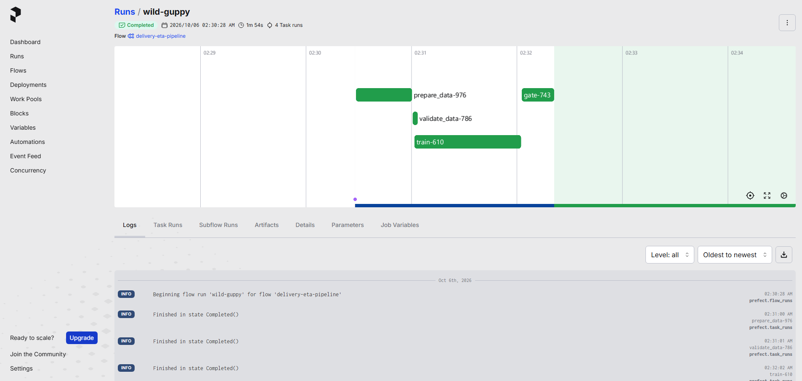
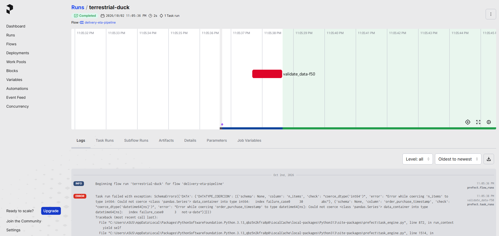

# รายงานโครงงาน: สินค้าจะมาถึงเมื่อไหร่ (CP413008)

ระบบพยากรณ์ระยะเวลาจัดส่งสินค้าสำหรับ E-commerce · ภาคเรียนที่ 1 ปีการศึกษา 2569

> **ยังต้องเติมก่อนส่ง**
> - แผนภาพสถาปัตยกรรม (`docs/architecture.md` หรือ `docs/img/arch-*.png`)
> - ส่วนที่ใช้ AI ช่วย ของสมาชิกทุกคน (หัวข้อ 9)
> - ภาพ MLflow: Compare runs, หน้า registry, ผล rollback (`docs/img/mlflow-*.png`)
> - สคริปต์สาธิต 12 นาที และผู้พูดแต่ละช่วง
> - ตรวจว่า AI Project Canvas ใน Canva ครบทุกช่อง

## สมาชิก

| รหัส | ชื่อ | GitHub | งานหลัก |
|---|---|---|---|
| 673380320-6 | นายธราเทพ เบญจพรหม | tharathep-kku | train, MLflow tracking/registry, schema, Docker, ตรวจ PR |
| 673380307-8 | นายกีรติ ชาวงษ์ | keerati-chawong | เตรียมข้อมูล order, monitoring และ drift |
| 673380327-2 | นางสาวพรนัชชา ทราบรัมย์ | Phonnatcha-kku | ออกแบบโมเดล, pipeline DAG, `prepare.py`, deploy |
| 673380361-2 | นายแดนชล ประไชโย | TonDanc | ข้อมูลดิบ, ข้อมูล demo, รายงาน |
| 673380338-7 | นางสาวมนัสนันท์ วรสุทธิพงษ์ | manatsanun | FastAPI, test cases, metrics, load test |
| 673380314-1 | นายถิรวัฒน์ วิเศษโวหาร | thirawatv-sketch | Dockerfile, Slack alert, CI/CD |

> ตรวจการจับคู่ชื่อกับ GitHub และงานหลักอีกครั้ง

---

## 1. การวางกรอบปัญหา

**Problem:** ลูกค้าไม่ทราบว่าสินค้าจะมาถึงเมื่อไหร่ ระยะเวลาที่แพลตฟอร์มแจ้งตอนนี้เผื่อเวลามากเกินไป (คลาดเคลื่อนเฉลี่ย ~11 วันบน test) ลูกค้าอาจเปลี่ยนใจไม่ซื้อ และเมื่อของมาช้ากว่าที่คาดก็ร้องเรียนและให้คะแนนร้านค้าต่ำ

**Stakeholder:** ลูกค้า (เห็น ETA ใกล้ความจริง), ผู้ขาย (คะแนนรีวิวดีขึ้นเมื่อส่งตรงตามที่แจ้ง), ฝ่ายบริการลูกค้า (ข้อร้องเรียนเรื่องส่งช้าน้อยลง)

**ML Solution:** ใช้ข้อมูลที่รู้ตั้งแต่ตอนสั่งซื้อ (ตำแหน่งผู้ซื้อและผู้ขาย ระยะทาง น้ำหนัก ราคา ค่าส่ง เวลาที่สั่ง) ทำนายจำนวนวันจัดส่งจริงของแต่ละ order (Regression, target `delivery_days`) เพื่อแสดง ETA ตอน checkout

**AI Project Canvas:** https://canva.link/db2g17u62fn8fzt

### ทำไมใช้ ML แทนการเขียนกฎ

เวลาส่งขึ้นกับหลายปัจจัยที่มีผลร่วมกัน (ระยะทาง × รัฐต้นทาง/ปลายทาง × น้ำหนัก × ช่วงเวลา) กฎที่เขียนมือจะต้องแจกแจงทุกคู่รัฐและทุกช่วง และต้องแก้ใหม่เมื่อพฤติกรรมขนส่งเปลี่ยน ส่วนโมเดลเรียนความสัมพันธ์นี้จากข้อมูลเองและเทรนใหม่ได้เมื่อเกิด drift

หลักฐาน: ค่าประมาณเดิมของ Olist (`estimated_delivery_days`) ได้ MAE 10.79 วันบน test ส่วนโมเดล HistGradientBoosting ได้ 3.39 วัน และแม้แต่ dummy ที่ทาย median ก็ยังได้ 5.06 วัน

### ตัวชี้วัด

| ประเภท | ตัวชี้วัด | เกณฑ์ |
|---|---|---|
| Optimizing metric | MAE (วัน) | ต่ำที่สุด |
| Gating metric | MAE เทียบ dummy | ต้องต่ำกว่า |
| Gating metric | MAE เทียบ `@champion` | ต่ำกว่าอย่างน้อย 5% |
| Gating metric | P95 latency ต่อ 1 order | < 200 ms |

**ตัวชี้วัดทางธุรกิจ:** Checkout Conversion Rate และ Late Delivery Rate (สัดส่วนที่ส่งช้ากว่า ETA ที่แสดง) MAE ต่ำลงทำให้ ETA ที่แสดงใกล้ความจริง ไม่ยาวเกินจนลูกค้าเลิกซื้อ และไม่สั้นเกินจนส่งช้ากว่าที่แจ้ง วัดความสำเร็จจริงด้วยการเทียบสองค่านี้ก่อนและหลังเปิดใช้ (A/B test)

### คำถามตรวจหัวข้อ 5 ข้อ

1. **ถ้าทำนายผิด ใครเดือดร้อน:** ทำนายเร็วกว่าจริง ลูกค้าไม่พอใจ ยกเลิก หรือให้รีวิวต่ำ ร้านเสียเครดิต CS รับข้อร้องเรียน ทำนายช้ากว่าจริงมาก ลูกค้าเห็นเวลานานเกินจึงไม่ซื้อ (cart abandonment) แพลตฟอร์มและร้านเสียรายได้
2. **ตัวชี้วัดธุรกิจเชื่อมกับโมเดลอย่างไร:** ดูหัวข้อตัวชี้วัดข้างบน
3. **ข้อมูลเปลี่ยนตามเวลาอย่างไร:** Data Drift เช่น ลูกค้าจากภาคเหนือที่ไกลเพิ่มขึ้น หรือช่วงเทศกาลสั่งของหนักขึ้น Concept Drift เช่น ขนส่งรับไม่ไหวช่วง Black Friday หรือบริษัทขนส่งเปลี่ยนศูนย์กระจาย ทำให้ order แบบเดิมส่งช้าลง
4. **ต้องตอบเร็วแค่ไหน:** real-time ตอน checkout ตั้ง SLO P95 ≤ 200 ms, throughput ≥ 50 req/s, error rate < 1%
5. **ถ้าโมเดลใหม่แย่กว่าเดิม รู้ได้อย่างไรและย้อนอย่างไร:** gate ปฏิเสธก่อนขึ้นใช้งานถ้าไม่ดีกว่าเดิม 5% หลังขึ้นแล้ว `monitor.py` เทียบ MAE กับเกณฑ์และแจ้ง Slack แล้วย้อนด้วย `registry.py rollback` ซึ่งย้าย alias `@champion` กลับไปเวอร์ชันก่อนหน้า

---

## 2. ข้อมูลและการตรวจสอบคุณภาพ

รายละเอียดทั้งหมดอยู่ใน [data.md](data.md)

- **Dataset:** Olist Brazilian E-commerce (Kaggle, CC BY-NC-SA 4.0) ก.ย. 2016 – ต.ค. 2018 หลังเตรียมแล้ว 95,824 order ใช้เทรนได้ 95,321 order
- **นำเข้าและทำซ้ำได้:** `src/prepare.py` แปลงข้อมูลดิบ 8 ไฟล์เป็น CSV ที่ใช้เทรน รันซ้ำได้ไฟล์เดิมทุก byte
- **แบ่งข้อมูล:** ตามเวลาสั่งซื้อ 70/15/15 (66,724 / 14,298 / 14,299) โมเดลเรียนจากอดีตแล้วทดสอบกับอนาคต ตรงกับการใช้งานจริงและกันข้อมูลอนาคตรั่วเข้า train
- **Schema:** Pandera (`src/schema.py`) ตรวจรัฐ, พิกัดในบราซิล, ช่วงค่า, ชนิดข้อมูล, ค่าว่าง และตัดคอลัมน์ที่รั่วคำตอบทิ้ง (`strict='filter'`)
- **ข้อมูลเสีย → หยุดและแจ้งเตือน:** ที่ API ได้ HTTP 422 และส่ง Slack ที่ pipeline หยุดที่ `validate_data` ด้วย exit 2 ไม่เทรนต่อ (หลักฐานในภาคผนวก ง)
- **ค่าที่หายไปและค่าผิดปกติ:** ตัด 503 order ที่ไม่มีพิกัด (ไม่ impute), ตัดพิกัดผิดปกติ, เติมน้ำหนักที่หายด้วย median, schema ปฏิเสธค่านอกช่วง

**กลไกกัน Training-Serving Skew:** การแปลงข้อมูลทั้งหมด (`add_features` + one-hot) อยู่ใน sklearn `Pipeline` ก้อนเดียวกับโมเดล และ log ลง MLflow ทั้งก้อน API โหลดก้อนนี้แล้วส่งข้อมูลที่ผ่าน schema ตัวเดียวกับตอนเทรนเข้า `predict()` ตรงๆ ไม่มีโค้ดแปลงข้อมูลชุดที่สอง

---

## 3. การพัฒนาโมเดล

รายละเอียดอยู่ใน [model.md](model.md)

| run | val MAE | test MAE | ตัดสินใจ |
|---|---:|---:|---|
| ค่าประมาณของ Olist | 15.00 | 10.79 | อ้างอิง |
| `dummy_median` (baseline) | 5.671 | 5.057 | เกณฑ์ขั้นต่ำ |
| `linear_regression` | 5.377 | 4.962 | ความสัมพันธ์ไม่เป็นเส้นตรง |
| **`hgb_default`** | **4.086** | **3.389** | **เลือก** |
| `hgb_bigger` | 4.092 | 3.412 | tuning ไม่ช่วย |

เลือก HistGradientBoosting (`loss='absolute_error'`) เพราะ MAE ต่ำสุดบน val, ปรับ MAE โดยตรงเหมาะกับ target เบ้ขวา, เทรน ~2 วินาที และไฟล์ 0.4 MB (Random Forest รุ่นแรกได้ MAE 4.07 ใช้ 1.5 นาทีและ 47 MB) โมเดลใหญ่ขึ้นไม่ช่วย จึงหยุด tuning

---

## 4. การติดตามการทดลองและทะเบียนโมเดล

รายละเอียดอยู่ใน [model.md](model.md#experiment-tracking-mlflow)

- ทุก run บันทึกครบ 6 อย่าง: `git_commit`, `data_md5`, hyperparameters, MAE/RMSE, ไฟล์โมเดล + `features.py`, `python`/`platform` + `requirements.txt`/`conda.yaml`
- เทียบข้าม run ได้ใน MLflow Compare
- สถานะโมเดลเป็น alias `@champion` / `@challenger` และ tag `gate`, `gate_reason`, `rolled_back`
- gate 3 ข้อ (ชนะ dummy, ดีกว่า champion 5%, P95 < 200 ms) ใช้ใน CI และ pipeline
- rollback ด้วย `python src/registry.py rollback` ย้าย alias กลับไปเวอร์ชันล่าสุดที่เคยผ่าน gate

---

## 5. การให้บริการและโครงสร้างพื้นฐาน

รายละเอียดอยู่ใน [serving.md](serving.md)

- **รูปแบบ:** real-time API (FastAPI) ใน Docker เพราะต้องตอบ ETA ทันทีตอน checkout
- **Endpoints:** `/predict`, `/health`, `/metrics`, หน้าเว็บ `/`, เอกสาร `/docs`
- **Metrics/Logs:** `/metrics` ให้ P50/P95, จำนวนคำขอ, rejected, errors และ log 1 บรรทัดต่อคำขอ
- **SLO:** P95 ≤ 200 ms, error rate < 1%, throughput ≥ 50 req/s

ผลล่าสุด (2,000 คำขอ, concurrency 20, 8 workers): P50 ~95 ms, **P95 ~225 ms**, ~180 req/s, error 0% throughput และ error rate ผ่าน P95 เกิน SLO เล็กน้อย ผลทุกรอบอยู่ในภาคผนวก ข

---

## 6. การเฝ้าระวังและ CI/CD

รายละเอียดอยู่ใน [monitoring.md](monitoring.md) และ [ci.md](ci.md)

| ด้าน | วัด | เกณฑ์แจ้งเตือน |
|---|---|---|
| Data Drift | PSI ของ `total_weight_g`, `distance_km` เทียบ train | PSI > 0.2 |
| Concept Drift | MAE ของ `@champion` บนข้อมูลช่วงล่าสุด | > test MAE + 2 วัน (5.389) และ input ไม่ drift |
| สถานะระบบ | `/metrics` | P95 > 200 ms หรือ error rate ≥ 1% |

**แยก Data Drift กับ Concept Drift:** Data Drift วัดจากการกระจายของ input ไม่ต้องรอคำตอบจริง Concept Drift วัดจาก MAE ที่ต้องรอของถึงมือลูกค้า ถ้า input drift ด้วยจะรายงานเป็น Data Drift เพราะ MAE ที่สูงขึ้นอธิบายได้ด้วย input ที่เปลี่ยน

| ข้อมูล | PSI distance | MAE | ผล | exit |
|---|---:|---:|---|---:|
| `normal_orders.csv` | 0.084 | 3.347 | ไม่พบ drift | 0 |
| `drift_north.csv` | 6.937 | 6.971 | Data Drift | 2 |
| `drift_blackfriday.csv` | 0.015 | 6.317 (เกินเกณฑ์ 7 วันติด) | Concept Drift | 3 |

**นโยบายเทรนใหม่:** MAE รายวันเกินเกณฑ์ 2 วันติดกัน หรือพบ Data Drift → แจ้ง Slack แล้วรัน `python src/pipeline.py` gate ตัดสินว่าจะขึ้นเป็น champion หรือไม่

**CI/CD:** GitHub Actions 3 job (โค้ด / ข้อมูล / โมเดล) มีหลักฐานทั้งรอบผ่านและรอบไม่ผ่านครบ 3 ด้านในภาคผนวก ก

---

## 7. Pipeline การทำซ้ำ และการกำกับดูแล

รายละเอียดอยู่ใน [pipeline.md](pipeline.md)

- **DAG (Prefect):** `prepare_data → validate_data → train → gate → deploy` สั่งรันซ้ำได้ทั้งกระบวนการ
- **คำสั่งเดียวจากข้อมูลดิบถึงการให้บริการ:** `docker compose up -d mlflow` แล้ว `MLFLOW_TRACKING_URI=http://localhost:5050 python src/pipeline.py --deploy`
- **ทำซ้ำได้:** ทุกไลบรารี pin เวอร์ชัน, `random_state=42`, แบ่งข้อมูลตามเวลาแบบตายตัว, `prepare.py` และ `make_demo_data.py` ได้ไฟล์เดิมทุก byte
- **Git:** ทำงานผ่าน branch และ Pull Request (22 PR)
- **รันจากเครื่องเปล่า:** ทดสอบจาก clone ใหม่ + conda env ว่าง + registry ว่าง ใช้งานได้ครบทุกส่วน (ภาคผนวก จ)

---

## 8. เหตุผลที่เลือกเครื่องมือ

| หน้าที่ | เครื่องมือ | เหตุผล |
|---|---|---|
| Version Control | Git + GitHub | ใช้ branch/PR ทำงานพร้อมกัน 6 คน และต่อกับ CI ได้ตรง |
| Containerization | Docker + docker compose | รัน MLflow server และ API ได้ด้วยคำสั่งเดียวบนทุกเครื่อง image เดียวใช้ทั้ง train และ API |
| Data Validation | Pandera | เขียน schema เป็นโค้ด Python ใช้ตัวเดียวกันทั้งตอนเทรนและใน API ไม่ต้องตั้ง server |
| Experiment Tracking | MLflow | บันทึก params/metrics/artifacts/environment ได้ครบ 6 อย่าง และมี UI เทียบ run |
| Model Registry | MLflow Registry | อยู่ที่เดียวกับ tracking ใช้ alias `@champion`/`@challenger` เป็นสถานะ และ API โหลดตาม alias ได้ตรง |
| Pipeline Orchestration | Prefect | `pip install` ตัวเดียว รันในเครื่องได้ทันทีไม่ต้องตั้ง scheduler/DB แบบ Airflow โค้ดเป็นฟังก์ชัน Python + `@flow`/`@task` คล้าย TaskFlow API ของ Airflow ที่เรียนใน lab |
| Model Serving | FastAPI + uvicorn | ตรวจ request ด้วย Pydantic, มี `/docs` อัตโนมัติ, scale ด้วย workers |
| Monitoring | Evidently + เขียนเอง | Evidently คำนวณ PSI/KS และสร้าง HTML report ให้ ไม่ต้องตั้ง Prometheus/Grafana ส่วน MAE รายวันและเกณฑ์เขียนเองเพราะเป็นกฎเฉพาะโครงงาน |
| CI/CD | GitHub Actions | ผูกกับ PR โดยตรง แยก job ตามด้านให้เห็นว่าอะไรล้ม |
| Alert | Slack Incoming Webhook | ใช้ standard library ส่งได้ ไม่เพิ่ม dependency |

---

## 9. ส่วนที่ใช้ AI ช่วย

> ทุกคนเติมส่วนของตัวเอง: ใช้เครื่องมืออะไร ช่วยส่วนไหน และอธิบายโค้ดทุกบรรทัดได้

| สมาชิก | เครื่องมือ | ช่วยส่วนไหน |
|---|---|---|
| thirawatv-sketch | Codex | เขียน workflow CI และ pin ruff, ทดสอบรอบเขียว/แดง, เขียนโมดูล alert, ตรวจกรณีเครือข่ายและ log ล้มเหลว, จัดทำเอกสารและภาพหลักฐาน (ผู้ใช้สร้าง webhook และส่งหลักฐาน Slack จริงเอง) |
| tharathep-kku | | |
| keerati-chawong | | |
| Phonnatcha-kku | | |
| TonDanc | | |
| manatsanun | | |

---

## 10. ข้อจำกัด

- P95 ที่ concurrency 20 ยังเกิน SLO 200 ms เล็กน้อย เวลา 3/4 ต่อคำขออยู่ที่ Pandera validate
- `/metrics` นับแยกต่อ worker (8 workers) ตัวนับรวมต้องดูจาก log หรือ load test
- ไฟล์ drift เป็นข้อมูลย้อนหลัง ไม่ใช่ traffic จริง API ยังไม่เก็บ payload ลงไฟล์ จึงยังต่อจาก API เข้า monitor อัตโนมัติไม่ได้
- สัปดาห์ Black Friday อยู่ใน train split MAE ที่วัดได้จึงดีกว่ากรณีเจอเหตุการณ์ครั้งแรก
- เทรนใหม่ใน demo ใช้ CSV ชุดเดิม gate จึงปฏิเสธ (ผลถูกต้อง) การเทรนใหม่จะช่วยจริงเมื่อมีข้อมูลช่วงใหม่
- `distance_km` เป็นระยะเส้นตรง dataset ไม่มีข้อมูลเส้นทางหรือบริษัทขนส่ง
- ยังไม่มีตัวตั้งเวลา monitor และ pipeline ต้องสั่งรันเอง

---

## ภาคผนวก ก: CI รอบผ่านและไม่ผ่าน

**รอบเขียว** (2 ต.ค. 2569, [PR #12](https://github.com/TonDanc/ML_project_group11/pull/12), [Actions run](https://github.com/TonDanc/ML_project_group11/actions/runs/37035012333), commit `878c2a4`) ผ่านครบ 3 job รวม 2 นาที 25 วินาที

| Job | ผล | เวลา |
|---|---|---|
| Code quality | ผ่าน | 13 วินาที |
| Data quality | ผ่าน: schema และ 6 test cases | 1 นาที 4 วินาที |
| Model quality | ผ่าน: `hgb_default` MAE 3.389 vs dummy 5.057, P95 9.2 ms → `PROMOTED v1` | 1 นาที 14 วินาที |

**รอบแดง** (3 ต.ค. 2569 PR ทดสอบแยก 3 อัน ไม่ได้ merge)

| กรณี | Code | Data | Model | หลักฐาน |
|---|---|---|---|---|
| โค้ด | ล้ม `F401: os imported but unused` | ผ่าน | ข้าม | [PR #13](https://github.com/TonDanc/ML_project_group11/pull/13), [run #3](https://github.com/TonDanc/ML_project_group11/actions/runs/37042385103) |
| ข้อมูล | ผ่าน | ล้ม `AssertionError` (`customer_lat=40.0` ไม่ถูกปฏิเสธ) | ข้าม | [PR #14](https://github.com/TonDanc/ML_project_group11/pull/14), [run #4](https://github.com/TonDanc/ML_project_group11/actions/runs/37042386868) |
| โมเดล | ผ่าน | ผ่าน | ล้ม `REJECTED: MAE 5.057 does not beat dummy 5.057` | [PR #15](https://github.com/TonDanc/ML_project_group11/pull/15), [run #5](https://github.com/TonDanc/ML_project_group11/actions/runs/37042391468) |

## ภาคผนวก ข: load test ทุกรอบ

2,000 คำขอต่อรอบ วัดด้วย `loadtest/run.py` บน Windows 11 + Docker Desktop (12 CPU, RAM ให้ Docker 7.5 GB)

| วันที่ | ตั้งค่า | concurrency | P50 / P95 (ms) | req/s | Error | หมายเหตุ |
|---|---|---:|---|---:|---:|---|
| 3 ต.ค. | workers=1 | 20 | 952.09 / 1166.74 | 21.03 | 0% | 1 คำขอใช้ CPU ~45 ms worker เดียวรับได้ ~22 req/s |
| 4 ต.ค. | workers=4 | 20 | 868.72 / 1459.39 | 22.34 | – | OpenMP ทุก worker แย่ง CPU |
| 4 ต.ค. | workers=4 + `OMP_NUM_THREADS=1` | 20 | 476.17 / 970.65 | 40.16 | – | |
| 4 ต.ค. | workers=8 + `OMP_NUM_THREADS=1` | 20 | 250.41 / 641.26 | 68.05 | – | RAM api 1.5 GB |
| 4 ต.ค. | workers=12 + `OMP_NUM_THREADS=1` | 20 | 209.26 / 552.21 | 78.66 | – | RAM 2.2 GB ได้เพิ่มแค่ 15% |
| 4 ต.ค. | **workers=8 (เลือก)**, image ใหม่ | 20 | 299.96 / 690.13 | 57.77 | 0% | |
| 4 ต.ค. | workers=8 รันซ้ำ | 20 | 301.53 / 672.82 | 58.46 | 0% | |
| 4 ต.ค. | workers=8 | 8 | 89.18 / 225.56 | 70.19 | 0% | |
| 6 ต.ค. | workers=8, clone + image ใหม่ | 20 | 94.45 / 228.54 | 179.12 | 0% | ดีขึ้นมาก ยังไม่ได้หาสาเหตุ |
| 6 ต.ค. | workers=8 รันซ้ำ | 20 | 95.10 / 223.38 | 182.77 | 0% | |

เลือก 8 workers เพราะ 12 workers ได้เพิ่มน้อยแต่ใช้ RAM เพิ่ม 0.7 GB

## ภาคผนวก ค: แจ้งเตือน Slack จริง

2 ต.ค. 2569 workspace `ML_Project_Group11`, channel `#all-mlprojectgroup11`, app `ML Group11 Alerts` ได้รับข้อความ `test` / `hello` จาก `send_alert('test', 'hello')` ภาพไม่มี webhook URL

`alerts.py` ผ่านการทดสอบ 15 กรณี (ไม่มี webhook, server จำลอง, HTTP 500, timeout, network error, URL เสีย, stdout/log เขียนไม่ได้, payload แปลงเป็น JSON ไม่ได้) ทั้งบน Python 3.14.6 และ 3.11.15

## ภาคผนวก ง: ผลทดสอบ pipeline

| วันที่ | คำสั่ง | ผล | Exit |
|---|---|---|---:|
| 2 ต.ค. | `pipeline.py --data demo_data/bad_orders.csv` | `validate_data` ล้ม (`n_items=abc`, `not-a-date`) ไม่เทรน | 2 |
| 2 ต.ค. | `pipeline.py` (รอบแรก, registry ว่าง) | MAE 3.389 ชนะ dummy 5.057 → PROMOTED v1 | 0 |
| 2 ต.ค. | `pipeline.py` (รอบสอง) | ไม่ดีกว่า v1 ถึง 5% → REJECTED | 3 |
| 6 ต.ค. | `CANDIDATES=dummy_median,linear_regression pipeline.py --deploy` | PROMOTED v1, API สร้างใหม่ตอบ version 1 | 0 |
| 6 ต.ค. | `CANDIDATES=hgb_default pipeline.py --deploy` | PROMOTED v2, API ตอบ version 2 | 0 |
| 6 ต.ค. | `pipeline.py --deploy --data demo_data/bad_orders.csv` | หยุดที่ validate ไม่แตะ API | 2 |
| 6 ต.ค. | `CANDIDATES=hgb_default pipeline.py --deploy` (ซ้ำ) | REJECTED ไม่แตะ API (ยังตอบ v2) | 3 |

## ภาคผนวก จ: รันจากเครื่องเปล่า

6 ต.ค. 2569: clone ใหม่จาก GitHub (`a4fa864`), conda env Python 3.11 ว่าง, ไม่มี container/volume ของโครงงาน, build image ใหม่

| ขั้น | เวลา | ผล |
|---|---|---|
| `pip install -r requirements.txt -r requirements-dag.txt` | 2 นาที 35 วินาที | สำเร็จ |
| `docker compose up -d mlflow` (build image ครั้งแรก) | ~80 วินาที | สำเร็จ |
| `MLFLOW_TRACKING_URI=http://localhost:5050 python src/pipeline.py --deploy` | 100 วินาที | ครบ 5 task, PROMOTED v1, API ตอบ v1, exit 0 |
| `prepare_data` สร้าง CSV | | ตรงกับที่ commit ไว้ทุก byte |
| `tests/check_cases.py` offline และ `--url` | | 6/6 ทั้งสองแบบ, `[ALERT]` ใน log ของ API |
| `pipeline.py --deploy --data demo_data/bad_orders.csv` | | exit 2 |
| `pipeline.py --deploy` ซ้ำ | 74 วินาที | gate ปฏิเสธ exit 3, API ยังใช้ v1 |
| `monitor.py` 3 ไฟล์ + `--api-url` | | exit 0 / 2 / 3, ตัวเลขตรงกับ [monitoring.md](monitoring.md) |
| ruff ตามคำสั่งใน CI | | All checks passed |
| `docker compose run --rm train` (ทาง Docker อย่างเดียว) | 38 วินาที | เทรนใน container ได้ gate ปฏิเสธตามคาด |
