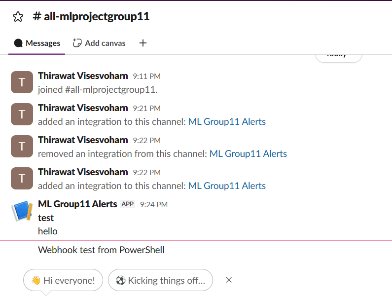

# Slack alert

งานของ `thirawatv-sketch` ตาม GUIDE ส่วน 3.A และ 4.3 ใช้เฉพาะ Python standard library จึงไม่ต้องเพิ่ม dependency

## หน้าที่และจุดสำคัญของโค้ด

- `send_alert(title, detail='')` อ่าน `SLACK_WEBHOOK_URL` แล้วส่ง HTTP POST เป็น JSON `{"text": "*หัวข้อ*\nรายละเอียด"}` ตั้ง network timeout 3 วินาที และตัดรายละเอียดไม่เกิน 1,000 ตัวอักษร
- เมื่อไม่ตั้ง webhook จะพิมพ์ `[ALERT]` และเขียนต่อท้าย `logs/alerts.log` โดยสร้างโฟลเดอร์ให้อัตโนมัติ เส้นทางนี้อ้างอิงจากโฟลเดอร์ที่รันคำสั่ง จึงควรรันจากโฟลเดอร์หลักของโปรเจกต์
- ถ้า URL ไม่ถูกต้อง, Slack ตอบ HTTP error หรือเครือข่ายมีปัญหา จะเก็บข้อความไว้ในเครื่องพร้อมชนิดของ error ไม่พิมพ์ข้อความ exception เพราะอาจมี webhook URL อยู่ด้วย
- `_write_local_alert` จับ error ของ stdout และไฟล์ log แยกกัน ถ้าเขียน log ไม่ได้ก็ยังพยายามพิมพ์ข้อความ และถ้าพิมพ์ไม่ได้ก็ยังพยายามเขียน log
- `notify_validation_failure(detail, payload=None)` ใช้หัวข้อ `Invalid prediction request rejected` เก็บรายละเอียด validation สูงสุด 700 ตัวอักษร และตัวอย่าง payload สูงสุด 280 ตัวอักษร เพื่อให้เห็นทั้งข้อผิดพลาดและข้อมูลที่ถูกปฏิเสธ
- คงชื่อและรูปแบบฟังก์ชันเดิมไว้ ผู้เรียกใน API และ monitoring จึงใช้สัญญาเดิมได้ ข้อความระบุชื่อคอลัมน์มาจาก `detail` ที่ผู้เรียกส่งมา

ทั้งสองฟังก์ชันคืน `None` และจับ `Exception` เพื่อให้ปัญหาของระบบแจ้งเตือนไม่ทำให้ API หรือ monitoring ล้ม ถ้าทั้ง Slack, stdout และไฟล์ log ใช้งานไม่ได้ การแจ้งเตือนอาจสูญหาย แต่ผู้เรียกยังทำงานต่อได้ การส่งเป็นแบบ synchronous จึงอาจทำให้ผู้เรียกรอเครือข่ายตาม timeout ไม่มี retry หรือคิวส่งซ้ำ

## ตั้งค่าและทดสอบบน PowerShell

รันจากโฟลเดอร์หลักของโปรเจกต์ด้วย Python 3.11 ตาม Dockerfile หรือ Python ที่รองรับ type hint ในโปรเจกต์นี้

ถ้าเครื่องนี้เรียกคำสั่ง `python` ไม่ได้ ให้แทน `python` ในตัวอย่างด้วย `& "$env:USERPROFILE\anaconda3\python.exe"` ซึ่งเป็น interpreter ที่ตรวจพบในเครื่องนี้

### 1. ทดสอบโดยไม่ใช้ Slack

```powershell
Remove-Item Env:SLACK_WEBHOOK_URL -ErrorAction SilentlyContinue
python -c "import sys; sys.path.insert(0, 'src'); import alerts; alerts.send_alert('test', 'hello')"
Get-Content -LiteralPath logs/alerts.log -Encoding UTF8
```

ต้องเห็น `[ALERT] test` กับ `hello` ในหน้าจอและไฟล์ log การรันซ้ำต้องต่อท้ายไฟล์เดิม

### 2. ทดสอบข้อมูลที่ validation ปฏิเสธ

```powershell
python -c "import sys; sys.path.insert(0, 'src'); import alerts; alerts.notify_validation_failure('total_weight_g must be non-negative', {'total_weight_g': -5})"
```

ต้องเห็นหัวข้อ `Invalid prediction request rejected`, ชื่อคอลัมน์ `total_weight_g` และ `Payload:`

### 3. ทดสอบเมื่อ URL ใช้ไม่ได้

```powershell
$env:SLACK_WEBHOOK_URL = 'invalid-url'
python -c "import sys; sys.path.insert(0, 'src'); import alerts; alerts.send_alert('test failure', 'caller must continue'); print('caller continued')"
Remove-Item Env:SLACK_WEBHOOK_URL -ErrorAction SilentlyContinue
```

ต้องเห็นข้อความ fallback และ `caller continued` โดยไม่มี traceback หลุดออกมา

### 4. ทดสอบ Slack จริง

สร้าง Incoming Webhook ของ workspace กลุ่ม แล้วตั้ง URL ใน environment ของเครื่อง ห้ามใส่ URL จริงในโค้ดหรือ commit ลง repo ใช้คำสั่งต่อไปนี้เพื่อรับค่าโดยไม่แสดงบนหน้าจอ:

```powershell
$taskWebhook = Read-Host 'Slack webhook URL' -AsSecureString
$env:SLACK_WEBHOOK_URL = [System.Net.NetworkCredential]::new('', $taskWebhook).Password
python -c "import sys; sys.path.insert(0, 'src'); import alerts; alerts.send_alert('test', 'hello')"
Remove-Item Env:SLACK_WEBHOOK_URL -ErrorAction SilentlyContinue
Remove-Variable taskWebhook -ErrorAction SilentlyContinue
```

ต้องเห็นข้อความใน Slack จริงจึงนับว่าส่งสำเร็จ exit code 0 เพียงอย่างเดียวยังยืนยันไม่ได้ เพราะฟังก์ชันจับ error ตามสัญญา เก็บภาพข้อความไว้เป็นหลักฐานก่อนเปิด PR โดยไม่ให้มี webhook URL ในภาพ

`docker-compose.yml` มีการส่ง `SLACK_WEBHOOK_URL` เข้า container API อยู่แล้ว ผู้ดูแล `src/api.py` และ `src/monitor.py` ต้องเรียกฟังก์ชันแจ้งเตือนในจุดที่เหมาะสม เอกสารนี้ทดสอบตัวโมดูล alert โดยตรง

## สถานะการตรวจสอบ

ตรวจผ่าน 15 กรณีด้วย Python 3.14.6 ที่ติดตั้งในเครื่อง และรันผ่านทั้งชุดซ้ำด้วย Python 3.11.15 ใน environment ชั่วคราว ให้ตรงกับเวอร์ชันหลักที่ Dockerfile และ CI ใช้:

- ไม่มี webhook หรือมีแต่ช่องว่าง: พิมพ์ข้อความและต่อท้าย log
- HTTP POST ไปยัง server จำลองในเครื่อง: ส่ง JSON และภาษาไทยได้ และจำกัดรายละเอียดไม่เกิน 1,000 ตัวอักษร
- HTTP 500, timeout, network error และ URL ใช้ไม่ได้: fallback ได้ ไม่โยน exception และไม่เผย URL จากข้อความ exception
- stdout ใช้ไม่ได้, log เขียนไม่ได้ หรือทุกช่องทางใช้ไม่ได้พร้อมกัน: ผู้เรียกยังทำงานต่อได้
- validation: มีชื่อคอลัมน์และ payload แม้รายละเอียดจะยาว และรับมือกับ payload ที่แปลงเป็น JSON ไม่ได้
- ตรวจว่าการส่งตั้ง timeout ไว้ 3 วินาที

ตัวทดสอบอัตโนมัติใช้โฟลเดอร์ชั่วคราวและ server จำลอง ส่วนผล Slack จริงตรวจแยกตามหลักฐานด้านล่าง

## ผลทดสอบ Slack จริง

วันที่ 2 ตุลาคม 2569 ผู้ใช้ส่งภาพผลทดสอบมา และตรวจยืนยันข้อความเดียวกันในช่อง Slack จริง:

- Workspace: `ML_Project_Group11`
- Channel: `#all-mlprojectgroup11`
- App: `ML Group11 Alerts`
- ข้อความ: หัวข้อ `test` และรายละเอียด `hello` เวลา 21:24 ตรงกับเคส `send_alert('test', 'hello')`
- พบข้อความ `Webhook test from PowerShell` เพิ่มเติมเวลา 21:26

การส่งเข้า Slack จริงสำเร็จ เก็บภาพจากช่องจริงไว้ที่ `docs/img/slack-alert-test.png` โดยไม่มี webhook URL อยู่ในภาพ



## สถานะส่งตรวจ

แยกเฉพาะงาน Slack จาก branch `Tan` มาไว้ใน branch `slack-alert` ของ `thirawatv-sketch` โดยเริ่มจาก `main` ล่าสุด งานนี้พร้อมให้ตรวจผ่าน PR ก่อนรวมเข้า `main` ส่วนงาน CI อยู่ใน [PR #12](https://github.com/TonDanc/ML_project_group11/pull/12) แยกต่างหาก

- [x] เติม `send_alert` และ `notify_validation_failure` โดยคงสัญญาของฟังก์ชัน
- [x] ตรวจ fallback, timeout, การตัดข้อความ และการไม่โยน exception
- [x] มีผลส่ง Slack จริงและภาพ `docs/img/slack-alert-test.png`
- [x] มีวิธีตั้งค่าและข้อความสำหรับผู้ทำรายงานในเอกสารนี้

PR นี้มีเฉพาะ `src/alerts.py`, `docs/slack-alert.md` และ `docs/img/slack-alert-test.png` ผู้ตรวจหลักตาม GUIDE คือ `tharathep-kku` และผู้ตรวจสำรองคือ `manatsanun` ยังไม่ได้ merge เข้า `main` การเชื่อมฟังก์ชันเข้ากับ API และ monitoring เป็นงานของผู้ดูแลไฟล์เหล่านั้น และต้องส่ง webhook URL ให้ผู้เชื่อมระบบทางแชตส่วนตัวถ้ายังไม่ได้ส่ง ห้ามใส่ URL ใน repo หรือภาพหลักฐาน

## ข้อมูลประกอบรายงาน

ใช้ Codex ช่วยเขียนโมดูล alert, ตรวจกรณีเครือข่ายและการเขียน log ล้มเหลว และจัดทำเอกสาร ผู้ใช้สร้าง webhook และส่งหลักฐานข้อความ Slack จริง ส่วน AI ช่วยตรวจหลักฐานและเตรียมไฟล์สำหรับส่งงาน

ประเด็นที่ใช้เขียนสิ่งที่เรียนรู้ได้: ระบบแจ้งเตือนต้องมี timeout และ fallback เพื่อไม่ทำให้ระบบหลักล้ม, ต้องเก็บ webhook URL เป็นความลับ และ exit code 0 ยังไม่ยืนยันว่าข้อความไปถึง Slack เพราะฟังก์ชันจับ error ไว้ ควรเรียบเรียงเป็นประสบการณ์ของผู้ใช้ตามที่เข้าใจจริงก่อนส่งให้ผู้ทำรายงาน
